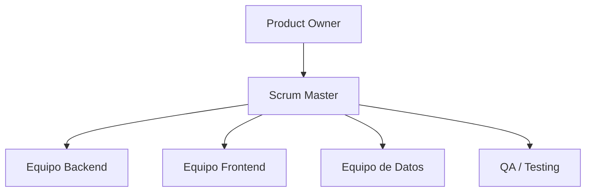

# ByteBuss

## Introducción
ByteBuss es un sistema integral para la **gestión inteligente del transporte público**. El proyecto busca digitalizar la operación del transporte urbano, mejorando la eficiencia y accesibilidad del servicio.  
A través de una aplicación web, una API REST, análisis de datos y una base de datos robusta, ByteBuss permite gestionar rutas, horarios, boletos con tecnología NFC y monitoreo en tiempo real de autobuses.

---

## Identidad Gráfica

| Logo del Producto | Logo de la Marca |
|-------------------|------------------|
|  |  |
---

## Descripción
ByteBuss integra tecnologías modernas para ofrecer una plataforma completa que cubre desde la administración de rutas y unidades hasta el análisis de datos de uso.  
El sistema incluye módulos para:
- Gestión de usuarios (pasajeros, conductores, administradores).
- Compra y validación de boletos NFC.
- Seguimiento en tiempo real de autobuses.
- Reportes y análisis en un Data Warehouse.

---

## Planteamiento del problema
En muchas ciudades, el transporte público carece de herramientas tecnológicas para optimizar rutas, controlar pagos y mejorar la experiencia del usuario. Esto provoca:
- Retrasos frecuentes y tiempos de espera altos.
- Poca transparencia en la gestión de ingresos.
- Falta de datos para la toma de decisiones.
- Experiencia de usuario limitada y poco accesible.

---

## Propuesta de solución
ByteBuss propone un ecosistema digital que incluye:
- **Frontend web** en Angular para la administración y visualización de datos.
- **API REST** en Node.js + Express para la gestión centralizada de la lógica de negocio.
- **Base de datos MySQL** para almacenamiento confiable y estructurado.
- **Notebooks de análisis** para ETL y modelos supervisados/no supervisados.
- **Data Warehouse** para indicadores clave (KPIs) y análisis avanzado.
- **Seguridad** con autenticación JWT, control de roles y cifrado de datos.
- **Despliegue en contenedores Docker** para facilitar la instalación y escalabilidad.

---

## Objetivo General
Desarrollar e implementar un sistema integral que optimice la gestión del transporte público urbano, mejorando la eficiencia operativa, la experiencia del usuario y la sostenibilidad.

---

## Objetivos Específicos
1. Implementar un sistema de compra y validación de boletos con tecnología NFC.
2. Proporcionar seguimiento en tiempo real de las unidades de transporte.
3. Desarrollar un módulo de reportes con indicadores clave.
4. Optimizar rutas y horarios mediante análisis de datos.
5. Garantizar seguridad y control de acceso por roles.

---

## Organigrama de Trabajo

---

## Tabla de Colaboradores

| Foto | Nombre Completo | Rol | GitHub |
|------|-----------------|-----|--------|
|  | Caro | Frontend Developer | [GitHub](https://github.com/CarolinaAR10) |
|  | Raúl | Backend Developer | [GitHub](https://github.com/RaulReyesB) |
|  | Zacek | Data Analyst | [GitHub](https://github.com/Zac-ek) |
|  | Edgar | QA Tester | [GitHub](https://github.com/Ederdal) |

---

## Diagrama de Gantt

---

## Lista de Tecnologías
- **Backend**: Node.js, Express, Sequelize
- **Frontend**: Angular
- **Base de Datos**: MySQL
- **Data**: Python, Pandas, Scikit-learn
- **Infraestructura**: Docker, Nginx
- **Control de Versiones**: GitHub
- **Gestión de Proyecto**: Jira, Trello
- **Documentación**: Swagger, Markdown

---
